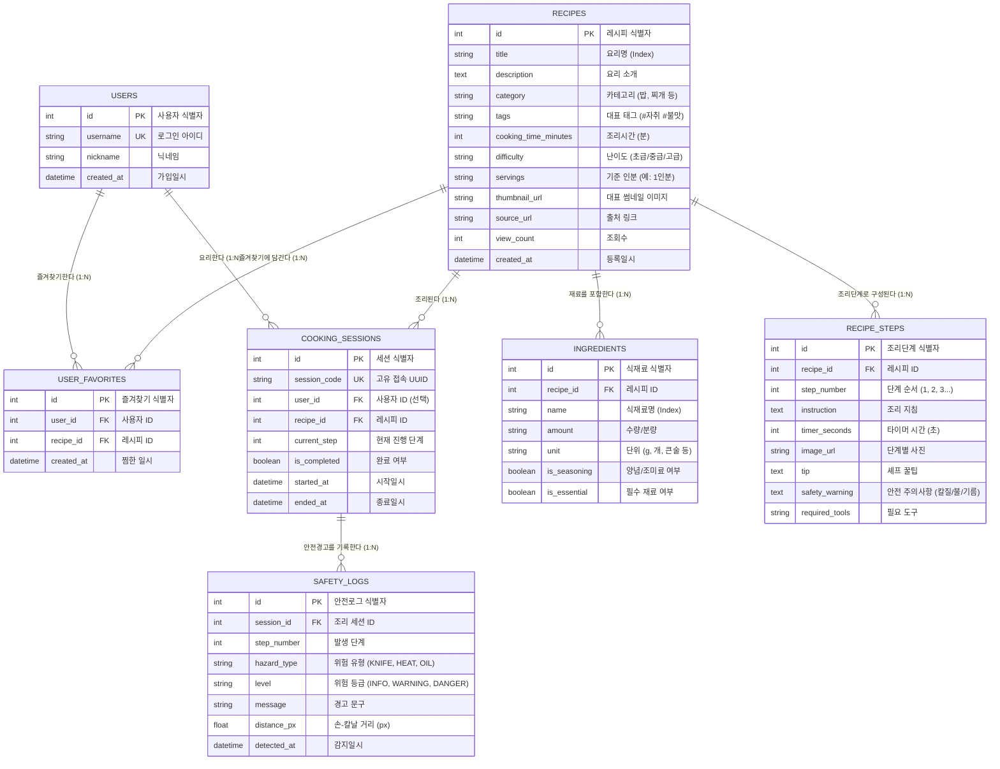

# 🗄️ YoCook 데이터베이스 설계서 & ERD (Entity Relationship Diagram)

비전 객체 인식 및 음성 AI 기반 스마트 요리 가이드(YoCook)의 최종 데이터베이스 설계 문서입니다.

---

## 1. ER 다이어그램 (ERD)

---

## 2. 테이블 상세 명세서

### 2.1 `USERS` (사용자 기본 정보)
| 컬럼명 | 데이터 타입 | 제약 조건 | 기본값 | 설명 |
| :--- | :--- | :---: | :---: | :--- |
| **`id`** | INTEGER | PK, Auto | - | 사용자 고유 번호 |
| **`username`** | VARCHAR(50) | UK, NOT NULL | - | 로그인 아이디 (예: `cookmaster`, `chulsoo123`) |
| **`nickname`** | VARCHAR(50) | NOT NULL | - | 사용자 닉네임 |
| **`created_at`** | DATETIME | NOT NULL | now() | 가입 일시 |

### 2.2 `USER_FAVORITES` (레시피 즐겨찾기)
| 컬럼명 | 데이터 타입 | 제약 조건 | 기본값 | 설명 |
| :--- | :--- | :---: | :---: | :--- |
| **`id`** | INTEGER | PK, Auto | - | 즐겨찾기 고유 번호 |
| **`user_id`** | INTEGER | FK (users.id), NOT NULL | - | 찜한 사용자 ID |
| **`recipe_id`** | INTEGER | FK (recipes.id), NOT NULL | - | 찜한 레시피 ID |
| **`created_at`** | DATETIME | NOT NULL | now() | 찜한 일시 |

> **고유 제약조건 (Unique Index)**: `UNIQUE(user_id, recipe_id)` (중복 찜 방지)

### 2.3 `RECIPES` (레시피 기본 정보)
| 컬럼명 | 데이터 타입 | 제약 조건 | 기본값 | 설명 |
| :--- | :--- | :---: | :---: | :--- |
| **`id`** | INTEGER | PK, Auto | - | 레시피 고유 번호 |
| **`title`** | VARCHAR(200) | NOT NULL, INDEX | - | 요리명 (예: 백종원 초간단 김치볶음밥) |
| **`description`** | TEXT | NULL | - | 요리 소개 및 특징 |
| **`category`** | VARCHAR(50) | NOT NULL, INDEX | '일반' | 요리 분류 (밥/볶음밥, 국/찌개, 반찬 등) |
| **`tags`** | VARCHAR(200) | NULL | - | 대표 해시태그 (예: `#자취요리 #초간단 #불맛`) |
| **`cooking_time_minutes`** | INTEGER | NOT NULL | 15 | 예상 조리 시간 (분 단위 숫자) |
| **`difficulty`** | VARCHAR(50) | NOT NULL | '초급' | 난이도 (초급, 중급, 고급) |
| **`servings`** | VARCHAR(50) | NOT NULL | '1인분' | 기준 분량 |
| **`thumbnail_url`** | VARCHAR(2048) | NULL | - | 대표 완성 사진 URL |
| **`source_url`** | VARCHAR(2048) | NULL | - | 원본 출처 링크 (만개의레시피 등) |
| **`view_count`** | INTEGER | NOT NULL | 0 | 조회수 |
| **`created_at`** | DATETIME | NOT NULL | now() | 등록 일시 |

### 2.4 `INGREDIENTS` (레시피 식재료)
| 컬럼명 | 데이터 타입 | 제약 조건 | 기본값 | 설명 |
| :--- | :--- | :---: | :---: | :--- |
| **`id`** | INTEGER | PK, Auto | - | 식재료 식별자 |
| **`recipe_id`** | INTEGER | FK (recipes.id), NOT NULL | - | 연결된 레시피 ID |
| **`name`** | VARCHAR(100) | NOT NULL, INDEX | - | 식재료명 (예: 신김치, 대파, 양파) |
| **`amount`** | VARCHAR(100) | NOT NULL | - | 분량 표기 (예: 1공기, 1/2대, 2큰술) |
| **`unit`** | VARCHAR(50) | NULL | - | 표준 단위 (g, ml, 개, 큰술 등) |
| **`is_seasoning`** | BOOLEAN | NOT NULL | False | 양념/조미료 여부 (True면 추천 계산 시 제외) |
| **`is_essential`** | BOOLEAN | NOT NULL | True | 필수 재료 여부 (True: 필수, False: 선택/토핑) |

### 2.5 `RECIPE_STEPS` (조리 단계 및 안전 가이드)
| 컬럼명 | 데이터 타입 | 제약 조건 | 기본값 | 설명 |
| :--- | :--- | :---: | :---: | :--- |
| **`id`** | INTEGER | PK, Auto | - | 단계 식별자 |
| **`recipe_id`** | INTEGER | FK (recipes.id), NOT NULL | - | 연결된 레시피 ID |
| **`step_number`** | INTEGER | NOT NULL | - | 단계 순서 (1, 2, 3...) |
| **`instruction`** | TEXT | NOT NULL | - | 조리 지침 본문 (음성 TTS 출력 대상) |
| **`timer_seconds`** | INTEGER | NOT NULL | 0 | 타이머 필요 시간 (초 단위, 0이면 없음) |
| **`image_url`** | VARCHAR(2048) | NULL | - | 단계별 설명 사진 URL |
| **`tip`** | TEXT | NULL | - | 셰프의 조리 꿀팁 |
| **`safety_warning`** | TEXT | NULL | - | **안전 주의사항** (칼질, 기름튐, 불 조심) |
| **`required_tools`** | VARCHAR(200) | NULL | - | **필요 도구** (예: "식칼, 도마, 프라이팬") |

### 2.6 `COOKING_SESSIONS` (실시간 조리 세션)
| 컬럼명 | 데이터 타입 | 제약 조건 | 기본값 | 설명 |
| :--- | :--- | :---: | :---: | :--- |
| **`id`** | INTEGER | PK, Auto | - | 세션 식별자 |
| **`session_code`** | VARCHAR(100) | UK, NOT NULL | - | WebSocket 접속용 고유 UUID |
| **`user_id`** | INTEGER | FK (users.id), NULL | - | 사용자 식별자 (비회원 가능) |
| **`recipe_id`** | INTEGER | FK (recipes.id), NOT NULL | - | 조리 중인 레시피 ID |
| **`current_step`** | INTEGER | NOT NULL | 1 | 현재 진행 중인 단계 |
| **`is_completed`** | BOOLEAN | NOT NULL | False | 조리 완료 여부 |
| **`started_at`** | DATETIME | NOT NULL | now() | 세션 시작 시간 |
| **`ended_at`** | DATETIME | NULL | - | 세션 종료 시간 |

### 2.7 `SAFETY_LOGS` (안전 경고 발생 이력)
| 컬럼명 | 데이터 타입 | 제약 조건 | 기본값 | 설명 |
| :--- | :--- | :---: | :---: | :--- |
| **`id`** | INTEGER | PK, Auto | - | 안전 로그 식별자 |
| **`session_id`** | INTEGER | FK (sessions.id), NOT NULL | - | 연결된 조리 세션 ID |
| **`step_number`** | INTEGER | NOT NULL | - | 경고 발생 단계 |
| **`hazard_type`** | VARCHAR(50) | NOT NULL | - | 위험 유형 (`KNIFE_PROXIMITY`, `HEAT_ABSENCE` 등) |
| **`level`** | VARCHAR(20) | NOT NULL | 'WARNING' | 위험 등급 (`INFO`, `WARNING`, `DANGER`) |
| **`message`** | VARCHAR(255) | NOT NULL | - | 경고 문구 |
| **`distance_px`** | FLOAT | NULL | - | 손-칼날 간 거리 (px) |
| **`detected_at`** | DATETIME | NOT NULL | now() | 감지 일시 |
